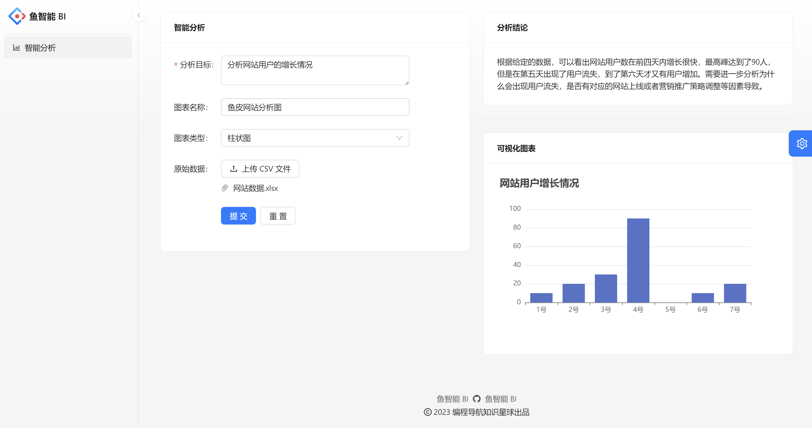

#  项目介绍

 **基于React+Spring Boot+MQ+AIGC的智能数据分析平台。**

1. 具体功能

区别于传统BI,用户只需要导入原始数据集、并输入分析诉求，就能自动生成可视化图表及分析结论，实现数据分
析的降本增效。

2. AIGC:

AI生成内容

# 项目界面

1. 图表生成界面

2. 我的图表界面

.png)

3. 图表生成界面

.png)

4. 架构图

.png)

# 技术栈

1. **前端**

   React18
   Ant Design Pro5.x脚手架
   Umi@4前端框架
   Ant Design组件库

   Echarts可视化库
   OpenAPI前端代码生成

2. **后端**
   Java Spring Boot(万用后端模板)
   MySQL数据库
   MyBatis-Plus及MyBatis X自动生成
   Redis+Redisson限流

   RabbitMQ消息队列
   鱼聪明AI SDK(AI能力)
   JDK线程池及异步化

   Easy Excel表格数据处理
   Swagger+Knife4j接口文档生成
   Hutool、.Apache Common Utils等工具库